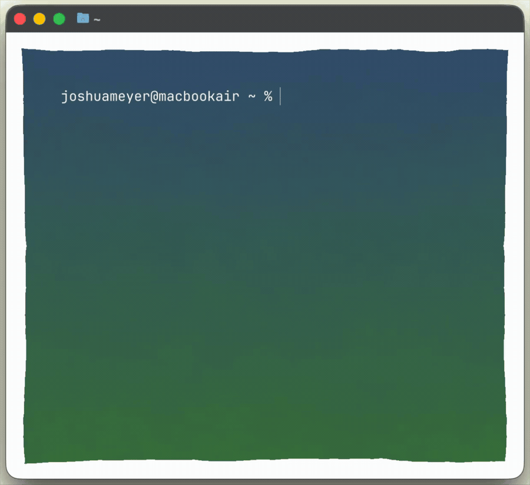

# Moonshine Flow

Moonshine Flow is a macOS menu-bar dictation app powered by [Moonshine](https://github.com/moonshine-ai/moonshine) for local, on-device speech recognition. Double-tap a key, speak, tap again to stop -- your words stream into whatever app has focus.

All transcription runs locally. No audio leaves your machine.

## Demo

<p align="center">
  
</p>

## How it works

1. Launch the app -- a microphone icon appears in the menu bar
2. Focus any text field (TextEdit, terminal, browser, Slack, etc.)
3. **Double-tap right Option** to start dictation
4. Speak -- text streams into the focused app in real time
5. **Tap right Option** once to stop

For standard text fields (Slack, Chrome, WhatsApp, TextEdit, Notes, etc.), text is inserted and updated live via the Accessibility API -- including partial text that refines as you speak.

For terminals (Ghostty, Terminal.app, iTerm2, kitty, etc.), completed sentences stream in via clipboard paste since terminals don't support AX text insertion.

## Requirements

- macOS 15 or newer on Apple Silicon
- Xcode (not just Command Line Tools)

## Quick start

```bash
git clone git@github.com:JRMeyer/MoonshineFlow.git
cd MoonshineFlow

# Download model files (~290MB)
MODEL_DIR=MoonshineFlow/models/medium-streaming-en
for f in adapter.ort cross_kv.ort decoder_kv.ort encoder.ort \
         frontend.ort streaming_config.json tokenizer.bin; do
  curl -L "https://download.moonshine.ai/model/medium-streaming-en/quantized/$f" \
    -o "$MODEL_DIR/$f"
done

# Build and run (SPM fetches the Moonshine package automatically)
swift build && swift run
```

See [SETUP.md](SETUP.md) for the full setup guide.

## Permissions

Grant all three in **System Settings > Privacy & Security**:

| Permission | Why |
|---|---|
| Microphone | Audio capture for transcription |
| Accessibility | Inserting text into focused apps |
| Input Monitoring | Global hotkey detection (right Option key) |

## Project layout

```
MoonshineFlow/
  MoonshineFlowApp.swift          App entry point (menu bar)
  Views/
    ContentView.swift              Menu bar popover UI
    SettingsView.swift             Settings window
  Dictation/
    DictationController.swift      Orchestrates the dictation session
    HotkeyManager.swift            Global hotkey via CGEvent tap
    AudioEngine.swift              Mic capture, resampled to 16kHz mono
    ChunkBuffer.swift              Splits audio into 0.6s chunks
    Transcriber.swift              Moonshine streaming transcription wrapper
    TextStateManager.swift         Tracks streaming text deltas
    TextInjector.swift             Inserts text via AX or clipboard paste
```

## Current behavior

- Double-tap right Option to start dictation; single tap to stop
- Text streams into the focused app as you speak
- AX-capable apps get live partial text that refines in place
- Terminals get committed sentences streamed via clipboard paste
- Transcriber is pre-initialized at launch for fast response
- Clipboard is saved before dictation and restored after

## License

See [LICENSE.txt](LICENSE.txt).
